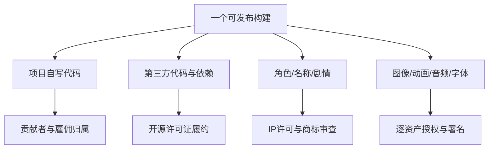

# W5｜IP、素材、开源许可与发布边界风险研究

- 日期：2026-08-23
- 状态：P0 风险报告，不是法律意见，也不构成发布授权
- 适用背景：中国团队/开发活动、GitHub 托管与可能的网络发布；若实际主体、服务器、发行地区不同，应由专业律师按具体事实复核。

## 结论先行

1. **这是两个独立的权利栈：**
   - 《熊出没》角色、名称、形象、剧情、音乐等方特 IP；
   - PVZ 的角色、名称、图像、音频、关卡表达与代码等相关权利。
   取得一个开源仓库的 MIT 许可，不会获得任何一方的 IP 授权。
2. “免费”“网上能下载”“粉丝制作”“仅供学习”“仓库公开”都不是许可证。GitHub 官方说明，无许可证时默认版权法适用；平台允许查看/fork 不等于允许复制、改编并公开发布。[GitHub：Licensing a repository](https://docs.github.com/articles/licensing-a-repository)、[GitHub Terms of Service](https://docs.github.com/site-policy/github-terms/github-terms-of-service)
3. 私有、本地、非商业能降低传播与商业化暴露，但**不是自动免责或授权**。中国著作权法的合理使用列举包括为个人学习、研究或欣赏使用已发表作品，同时要求注明来源且不得影响正常使用、不得不合理损害权利人合法权益；是否覆盖一个完整可玩同人游戏取决于具体使用方式，不能自行保证。[国家版权局《中华人民共和国著作权法》（2020 修正）](https://www.ncac.gov.cn/xxfb/flfg/flfg_532/202103/t20210309_50530.html)
4. 将仓库改为公开、向第三人提供构建、发布可执行文件、展示含原作素材的视频、开赞助/广告/内购、上架或售卖周边，会逐层增加复制、传播、改编、商标混淆与平台下架风险。**任何公开发布前都应获得相关权利人书面许可或把产品改成完全原创表达，并做专业法律审查。**
5. 当前日期 2026-08-23，中国现行商标法仍是 2019 年修正版；2026 年通过的新修订自 2027-01-01 起施行。发布计划跨到 2027 年时需要重新评估，不能把未来法律提前当作现行规则。[国家知识产权局：2019 年商标法文本](https://www.cnipa.gov.cn/art/2019/7/30/art_95_28179.html)、[国家知识产权局：2026 年修订与施行日期](https://www.cnipa.gov.cn/art/2026/6/26/art_95_206942.html)
6. 本项目现在最安全的工程动作是：**研究报告可继续，正式游戏代码和受保护素材先不写入；建立来源台账；用原创几何占位物验证机制；公开 PR 只包含研究文字和引用链接。**

## 权利层次：不能用一张 LICENSE 覆盖全部

只有每一条都清楚，构建才具备进入发布审查的条件。

## 法律与平台事实（官方来源）

### 中国著作权

《著作权法》第十条列出复制、发行、信息网络传播、改编等权利；第十三条规定改编等产生的作品，其著作权行使不得侵犯原作品著作权；第二十四条列举合理使用场景并附带来源标明及“三步检验”式限制。由此可做的风险推导是：

- 自己重画角色、重写剧情或把动画角色改成游戏单位，仍可能涉及对原作品的改编，不因“自己画”而自动独立；
- 把文件放入可被他人拉取的仓库、发构建或公开视频，可能触及复制和信息网络传播等权利；
- “个人学习研究”不能被项目自行声明成覆盖所有使用的许可证。

来源：[国家版权局《中华人民共和国著作权法》](https://www.ncac.gov.cn/xxfb/flfg/flfg_532/202103/t20210309_50530.html)。以上是工程风险解释，最终适用需律师结合事实判断。

《计算机软件保护条例》对软件复制、发行、通过信息网络传播等权利及侵权责任另有规定，并对经合法授权软件的修改与向第三方提供作出边界。工程含义是：能读到 clone 或 mod 的源码，不代表可把其代码改后交付团队或发布。[司法部法规库《计算机软件保护条例》](https://xzfg.moj.gov.cn/front/law/detail?LawID=913)

中国法院也已处理开源许可履约争议，说明开源条款不是“礼貌性建议”。具体案件不能自动决定本项目责任，但足以支持把许可清单、版本和通知作为发布门槛。[最高人民法院知识产权法庭：开源软件相关案例材料](https://ipc.court.gov.cn/zh-cn/news/view-3773.html)

### 商标与来源混淆

即使某个玩法机制可独立实现，使用“Plants vs. Zombies/PVZ/植物大战僵尸”“熊出没”名称、相似 logo、角色图形或让用户以为作品获官方合作，仍可能产生商标、反不正当竞争或平台政策风险。风险不能只靠页脚写“非官方”消除。现行法源见：[国家知识产权局 2019 年商标法](https://www.cnipa.gov.cn/art/2019/7/30/art_95_28179.html)。

### GitHub 与下架

- 无许可证：默认版权保护，除平台内查看/fork 外没有一般复用授权。[GitHub licensing 指南](https://docs.github.com/articles/licensing-a-repository)
- GitHub 的许可证检测只识别可检测的仓库许可证，不审计依赖、素材或实际权利归属，也不是法律意见。[GitHub Licenses API](https://docs.github.com/en/rest/licenses/licenses)
- 权利人可通过 GitHub DMCA 流程请求移除内容；平台下架不是唯一法律风险，但会直接中断协作和分发。[GitHub DMCA Takedown Policy](https://docs.github.com/en/site-policy/content-removal-policies/dmca-takedown-policy)

## 场景风险矩阵

下表是相对风险，不是“低风险即合法”。

| 场景 | 传播/商业特征 | 主要风险 | 建议门槛 |
|---|---|---|---|
| 个人离线纸面设计 | 不含素材、不发构建 | 事实引用与截图使用边界 | 引用来源；尽量用文字描述，不复制大段内容 |
| 私有仓库、原创占位物 PoC | 少量获准协作者，只测机制 | 第三方代码许可、协作者访问、误提交资产 | 访问最小化；许可台账；pre-commit/CI 扫描；不放原作素材 |
| 私有仓库、含抓取的原作素材 | 虽不公开但已复制、改编并向团队提供 | 版权与软件/素材来源；“内部”不等于授权 | **不建议**；删出仓库，改用原创占位物；必要时律师审查 |
| 公开视频/直播演示 | 网络传播，可能含角色、音乐、UI | 内容识别、投诉、商标混淆、平台下架 | 在无授权前不展示受保护表达；只演示原创抽象 PoC |
| 公开源码仓库 | 可全球复制/fork | 代码、素材、衍生表达和许可证全部外传 | 权利清零或书面授权；SBOM/NOTICE；律师复核 |
| 免费公开构建 | 非收费但可下载 | 免费不消除复制、传播、改编风险 | 与商业发布相同的权利审查，不以“免费”降级 |
| 捐赠/广告/内购/众筹 | 直接或间接变现 | 商业利用、消费者混淆、平台合同与税务 | 权利人书面许可、主体和发行合同、律师审查 |
| 商店上架/周边/联运 | 大规模发行与品牌使用 | 最高版权、商标、合同、素材链风险 | 正式 IP 授权 + 全量资产链 + 发行地区审查 |

## 资产类别逐项规则

| 类别 | 常见误区 | 本项目最低要求 | 未满足时 |
|---|---|---|---|
| 自写代码 | “作者就是项目，所以自动清楚” | 明确贡献者、雇佣/委托归属、提交许可；保留作者记录 | 不公开/不商业发布相关部分 |
| 开源代码 | “MIT 就什么都能拿” | 固定仓库、commit、文件、许可证、版权通知、修改；检查依赖 | 不集成；只读其思想后独立实现仍需避免实质复制争议 |
| 无许可证 GitHub 代码 | “公开仓库可以用” | 获作者明确书面许可或换候选 | 禁止复制、修改、打包 |
| 《熊出没》角色/名称/剧情 | “同人、非商业、自己画就行” | 权利人对目标媒介、地区、期限、商业方式的明确授权 | 仅做不含该表达的原创机制 PoC |
| PVZ 角色/名称/关卡表达 | “玩法借鉴所以素材也能借” | 不复制角色、图像、音频、文本、关卡、UI 与代码；公开产品需原创表达/审查 | 从仓库和构建中移除 |
| 截图/视频片段 | “研究文档可任意整段转载” | 只在必要范围引用，优先文字与链接，标明来源；不做素材库 | 不存储/不发布片段 |
| 粉丝图、模型、音效 | “作者同意就够” | 作者权利 + 原 IP 权利两层都清楚；书面许可含改编/分发 | 不使用 |
| AI 生成素材 | “生成即无风险” | 保存提示、模型/服务条款、输入来源；做相似性和商标审查 | 仅内部占位或重做，不当权利清零工具 |
| 字体 | “系统能显示即可随游戏发” | 确认嵌入/再分发许可；保存字体文件许可证与版权声明 | 使用操作系统回退或换明确授权字体 |
| 音乐/音效 | “短、变调、翻奏就安全” | 词曲、录音、表演、素材包各层权利清楚 | 原创/委托或明确商用素材 |
| 商标/logo/商店元数据 | “加非官方声明就够” | 名称检索、来源混淆审查、授权范围与商店规则 | 使用原创项目代号；不公开品牌页面 |

## 字体与通用素材许可

SIL Open Font License 允许在条件下使用、修改和再分发字体，字体可以与软件一起捆绑，通常不会让整个软件受 OFL 约束；但需要保留版权和许可信息，并注意 Reserved Font Name 等条款。[SIL OFL 官方站](https://openfontlicense.org/)、[OFL FAQ](https://openfontlicense.org/ofl-faq/)、[How to use OFL fonts](https://openfontlicense.org/how-to-use-ofl-fonts)

Creative Commons 不是一个统一许可：BY、SA、NC、ND 和 CC0 条件不同。特别是：

- `CC BY` 要求署名、许可链接和修改说明；
- `NC` 对商业、赞助、广告、平台分成等情形可能产生解释风险；
- `ND` 不适合需要切图、调色、动画化等改编的游戏资产；
- `SA` 可能对改编素材的许可方式提出传递要求；
- `CC0` 仍不保证素材中人物肖像、商标或第三方内容均已清权。

来源：[Creative Commons 许可证说明](https://creativecommons.org/share-your-work/cclicenses/)、[Creative Commons CC0](https://creativecommons.org/public-domain/cc0/)。

## 项目需要建立的权利台账

建议新增台账，但**本报告不自行创建项目制度或修改 decisions**。每一项资产/依赖至少记录：

| 字段 | 示例/说明 |
|---|---|
| 唯一 ID | `asset-ui-font-001` |
| 文件路径/包名 | 仓库内精确路径、npm/Godot addon 名称 |
| 类型 | code/image/audio/font/video/text/model |
| 作者/权利人 | 不只记录上传者昵称 |
| 来源 URL | 原始发布页，不用二次网盘 |
| 获取日期与版本/SHA | 可复现 |
| 许可证全文与版本 | MIT、CC BY 4.0、OFL 1.1 等；保存副本 |
| 适用范围 | 哪些文件是代码，哪些素材另有许可 |
| 署名/NOTICE 文案 | 可直接进入 credits/THIRD_PARTY_NOTICES |
| 是否修改 | 改了什么、谁改、何时改 |
| 商业/地区/平台限制 | 合同或许可中的条件 |
| 审核状态 | `research-only / placeholder / approved / blocked` |
| 替换计划 | 占位物在何门禁前必须删除 |

## 安全的研究—原型—发布流程

### Gate 0：研究（当前阶段）

- 只提交文字分析、短必要引述和来源链接；
- 不下载/归档整集动画、游戏包、反编译内容或搬运素材；
- GitHub 候选必须记录根许可证与素材许可证；
- 不把研究倾向写入 `docs/decisions.md`。

### Gate 1：原创占位原型

- 只用几何形、内部自制临时音效和明确可用字体；
- 名称使用 `bear_a`、`tool_unit` 等功能代号，不复刻 logo/UI；
- 对第三方代码做 SHA + 许可证 + 文件级记录；
- 自动阻止常见媒体文件、可执行包和超大二进制误提交。

### Gate 2：内部可玩

- 确认每位测试者获准访问；构建带内部标记，不公开链接；
- 全量扫描占位物、第三方通知、依赖和生成素材；
- 未获权的 IP 表达仍不得因为“内部测试”进入构建。

### Gate 3：公开演示/仓库

- 权利台账没有 `unknown/blocked`；
- 已获得必要书面许可，或项目已转为原创角色、名称、剧情、图像和音频；
- 律师审查 IP、商标、开源和发行地区；
- 完成 `LICENSE`、`THIRD_PARTY_NOTICES`、credits、隐私/平台材料；
- 从干净 clone 构建并检查最终包，不只审查源码目录。

### Gate 4：商业发布

- 书面 IP 授权明确媒介、地区、期限、平台、宣传、衍生品、收入和素材审批；
- 合同链、贡献者链、商店主体、隐私/数据、支付/税务另行完成；
- 若在 2027-01-01 后发行，重新检查中国商标法修订及其他届时现行规则。

## 立即可执行的仓库防护建议

这些是建议，尚未执行：

1. 维持私有仓库，最小化协作者；PR 不包含动画截图、录音、游戏包或抓取素材。
2. 建立 `.gitignore` 与大小文件/媒体扩展检查，但不能把“未提交”误解为“可合法使用”。
3. 每次新增第三方依赖时要求来源、SHA、许可证和素材分层；没有就阻断合并。
4. 构建只接受台账为 `approved` 的资产；`placeholder` 不能进入公开包。
5. 定期从干净 clone 生成最终文件清单，搜索品牌名、原作文件名、未知二进制和许可证遗漏。
6. 对外文案在获得授权前避免“官方”“正版”“联名”等暗示，不把免责声明当授权替代品。

## 对本项目当前素材来源的判定规则

| 来源 | 研究可否引用 | 可否进正式构建 | 条件 |
|---|---:|---:|---|
| 方特/央视公开页面 | 可以，链接并有限概述 | 页面素材不当然可以 | 需单独授权；网页可访问不等于素材许可 |
| B站官方/粉丝视频 | 可以作为事实或社区观察，明确身份 | 不当然可以 | 视频、音乐、弹幕、截图都有各自权利 |
| Reddit/玩家 Wiki | 可以作为玩家观点/线索 | 不可直接当资产源 | 观点不等于权利链；不得把粉丝设定写成官方事实 |
| MIT 代码仓库 | 可以研究 | 条件式可以 | 确认具体文件、保留许可/版权；素材另审 |
| CC BY 素材 | 可以研究 | 条件式可以 | 署名、链接、修改说明；确认上传者有权许可 |
| 无许可证仓库/网盘包 | 可以仅浏览公开描述 | 不可以 | 获明确授权前阻断 |
| 原创内部占位物 | 可以 | 仅内部 | 记录作者；公开前仍做相似性/商标检查 |

## 明确不建议

1. 不把项目设为 public，直到 IP 与第三方许可路径获明确决定并通过 Gate 3。
2. 不把 PVZ clone、同人改版、翻译包或网盘安装包当素材/代码供应源。
3. 不抓取《熊出没》官方图、角色模型、配音、音乐或截图放入仓库，即使仓库目前私有。
4. 不把“非商业/学习用/侵删”写进 README 后当作免责方案。
5. 不承诺公开 demo、众筹、赞助、广告或商店页面，直到权利人许可和法律审查完成。
6. 不让 AI 重绘成为规避角色形象授权的手段。

## 仍需用户/GPT 决定

- 项目最终目标是纯私人学习、封闭内部原型、申请正式 IP 授权，还是转为原创题材；这会决定后续能否写正式游戏代码与素材策略。
- 是否授权团队联系方特及 PVZ 相关权利人；联系前需准备项目主体、使用范围和商业计划。
- 是否批准建立 `THIRD_PARTY_NOTICES`/资产台账/贡献者协议等制度性文件；研究负责人不自行落决策。
- 私有构建允许给哪些人、通过什么渠道分发；“团队成员”边界需要明确。
- 发布地区、平台和预计日期；若跨 2027 年，法律与平台规则必须重新检索。
- 是否在任何授权未确定前，把后续 PoC 完全改用原创代号与几何占位物。

