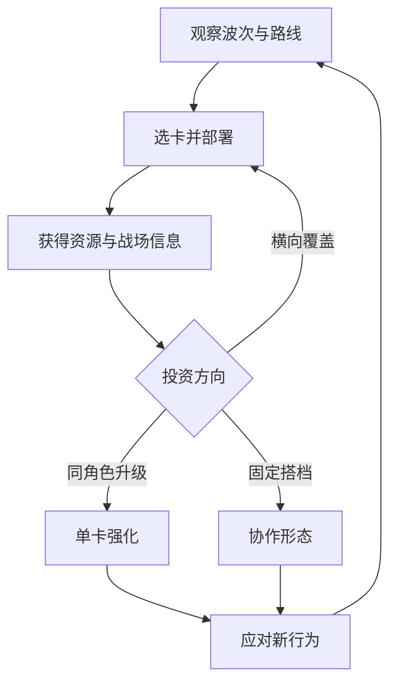

# W3｜路线塔防 × 同角色升级 × 固定跨角色融合研究

- 日期：2026-08-23
- 状态：P0 研究报告，不是数值或系统定案
- 目标：从 PVZ、塔防、合成游戏和玩家社区中提炼可验证的设计规则，重点回答“怎样让融合产生选择，而不是滚雪球或配方记忆负担”。

## 结论先行

1. **基础循环应先成立，融合才有资格加入。**玩家必须先能读懂路线、敌人、资源、攻击范围与波次；George Fan 对《Plants vs. Zombies》教学的复盘强调把教学融入游玩、逐步引入机制，而不是先让玩家读一套说明书。[GDC Vault：George Fan《How I Got My Mom to Play Through Plants vs. Zombies》](https://www.gdcvault.com/play/1015541/How-I-Got-My-Mom)
2. 同角色合成有指数成本：若一级角色为 1 个单位，无额外掉落时，合到第 `n` 级至少需要 `2^(n-1)` 个一级单位。它会自然制造“集中投资 vs. 多路覆盖”抉择，但也会快速造成强弱分层和补卡等待。[Game Design Consulting：Merge Games 的指数投入与棋盘空间](https://gamedesign.consulting/at-the-frontier-of-merge-games/)
3. **固定跨角色配方比随机融合更适合本项目。**随机结果可能把一个可用防线变成坏板面，App Store 玩家对《Rush Royale》的典型抱怨正是合成后随机单位会让胜局突然失控；这是用户评论，不是普遍因果证明，但风险与本项目“角色关系可理解”的目标一致。[《Rush Royale》App Store 页面与评论](https://apps.apple.com/us/app/rush-royale-tower-defense-rpg/id1526121033)
4. 融合必须有机会成本：占用两张卡/两个已部署单位、失去一条路的覆盖、消耗资源或冷却、锁定格子、改变目标类型。若融合只有收益，最优策略会退化成“能合就合”。
5. 反雪球的主手段应是**限制集中投资的外部性**，而不是让后期敌人单纯涨血：路线分压、敌人行为差异、融合用途窄化、软上限、回收损耗、Boss 阶段性机制，都比全面数值膨胀更可读。
6. B站《PVZ融合版》和 Reddit 讨论能证明玩家对“发现组合、夸张反馈、强敌对强植物”有兴趣，也同时暴露配方量爆炸、画面拥挤、固定强势组合和下载/版本混乱。社区反应是灵感与风险信号，不是平衡结论。

## 研究来源分层

### 一手/高可信设计资料

- [GDC Vault：George Fan 的 PVZ 教学演讲](https://www.gdcvault.com/play/1015541/How-I-Got-My-Mom)：逐步教学、降低非核心玩家门槛。
- [Game Developer 对该演讲的十条教学总结](https://www.gamedeveloper.com/design/gdc-2012-10-tutorial-tips-from-i-plants-vs-zombies-i-creator-george-fan)：教学应嵌入游戏、一次只教足够内容。
- [PC Gamer：PVZ 制作过程与早期牌组思路](https://www.pcgamer.com/making-of-plants-vs-zombies/2/)：早期曾受卡牌选择和 Magic draft 启发，说明战前有限选择是核心设计变量，不应默认全卡常驻。
- [Defender's Quest 设计复盘](https://www.fortressofdoors.com/optimizing-tower-defense-for-focus-and-thinking-defenders-quest/)：塔与敌人应在多个情境有用，避免硬克制导致单一答案。
- [Game Developer：Tower Defense Game Rules](https://www.gamedeveloper.com/design/tower-defense-game-rules-part-1-)：目标、路线、胜负与建造规则需要先构成可解释系统。
- [Game Design Consulting：Merge 设计](https://gamedesign.consulting/at-the-frontier-of-merge-games/)与[Game Economist：Merge 经济](https://www.gameeconomistconsulting.com/the-economics-of-merge-games/)：棋盘空间、产出吞吐与指数需求共同决定节奏。

### 玩家/社区观察（不能当普遍事实）

- [Reddit：玩家设想 PVZ3 时反对取消战前选卡、反对生命等待](https://www.reddit.com/r/PlantsVSZombies/comments/167bo48/if_you_were_to_make_pvz3_then_how_would_you/)
- [Reddit：传送带供给速度跟不上波次的抱怨](https://www.reddit.com/r/PlantsVSZombies/comments/1mvbwzm/ive_been_really_enjoying_gardendless_but/)
- [Reddit：PVZ2 后期强度膨胀与平衡疲劳](https://www.reddit.com/r/PlantsVSZombies/comments/sz29e8/im_beginning_to_lose_faith_in_pvz2_im_extremely/)
- [Reddit：Boss 高费用、慢节奏被认为“难但不好玩”](https://www.reddit.com/r/PlantsVSZombies/comments/1ltrqbg/this_is_the_most_awful_boss_design_in_the_game/)
- [B站：蓝飘飘fly《PVZ融合版》3.0 预告](https://www.bilibili.com/video/BV1kRnozeEKb/)、[2.7 更新动态](https://www.bilibili.com/opus/1086088317381902344)、[3.1 更新动态](https://www.bilibili.com/opus/1134038036652228610)
- [Biligame 玩家 Wiki 明示其为非官方同人版本](https://wiki.biligame.com/pvzrh/%E9%A6%96%E9%A1%B5)
- [Reddit：玩家称融合版“融合植物、僵尸也同样强”带来乐趣](https://www.reddit.com/r/PlantsVSZombies/comments/1jhr29q/pvz_fusion_is_the_most_fun_ive_ever_had_with_a/)
- [Reddit：玩家展示高复杂防线并讨论可读性](https://www.reddit.com/r/PlantsVSZombies/comments/1ixxhjf/what_is_this_defense_for_lmao/)
- [Reddit：玩家比较融合版本时提到固定强势组合](https://www.reddit.com/r/PlantsVSZombies/comments/1rs5d68/which_is_better_fusion_or_pvz2/)

社区链接只说明“这些反馈真实存在”，不证明所有玩家都这样想，也不支持照搬同人版内容、数值、图像或代码。

## 推荐的可验证核心循环

这个循环有三条投资路径：

- **横向部署**：扩大多路覆盖，损失单点强度；
- **同角色升级**：保留角色身份，提高一个岗位的效率，消耗复制单位；
- **固定搭档融合**：改变功能或攻击几何，牺牲两张独立卡的灵活性。

只有三者在不同局面都可能正确，融合才是策略。如果融合始终等于更高 DPS，循环会收缩成一条线。

## 5 路、格子、波次与资源

### 5 路结构

当前产品把 5 路作为默认方向，而 `5×9` 尚未决定。玩法研究建议先用“5 路 + 可参数化列数”测试，避免研究报告替项目锁死棋盘。

可测假设：

- 单位默认只影响本路，使路线压力可读；少数角色通过对空、邻路或地下来打破规则；
- 敌人越线惩罚应早显示、慢动画、一次一条路，避免玩家不知道为何失败；
- 路线重分配应有预警，不做无提示换路；萝卜头等改线能力限制在相邻一格或一次性技能。

### 波次

波次不是单纯休息时间。GameDev StackExchange 的社区讨论认为波次能让玩家消化新机制、评估并调整；这是社区经验，不是唯一正确模型。[“Why have waves in tower defense?” 讨论](https://gamedev.stackexchange.com/questions/65952/why-would-one-have-waves-in-each-stage-of-a-tower-defense-game)

建议原型：

1. 第一小波只验证一条攻击/承伤关系；
2. 第二小波增加另一条路，迫使横向覆盖；
3. 第三小波给出同角色升级材料，但不强迫升级；
4. 第四小波预告固定融合配方；
5. 旗帜波验证玩家能否在“覆盖、升级、融合”间改计划。

不建议：在玩家尚未读懂普通单位时同时加入资源盗取、飞行、换路和 Boss。

### 资源方案的研究边界

单双资源尚未决定。可比较两个最小原型：

| 原型 | 支付部署 | 支付升级/融合 | 优点 | 风险 |
|---|---|---|---|---|
| R1 单资源 | 同一种 | 同一种 | 教学最简单；所有选择可直接比较 | 高收益角色可能同时加速自身成长，形成正反馈 |
| R2 双资源 | 常规资源 | 稀有“默契/工具”资源 | 能限制融合频率，不必抬高普通部署成本 | 多一个 UI、掉落与节奏系统；若只为限频可能过度设计 |

**先测 R1**并用冷却/材料/占格控制融合；只有 R1 无法避免滚雪球时，才证明 R2 的额外复杂度有价值。这是研究建议，不是产品决定。

## 同角色升级：指数成本与软上限

若每次两个同级单位合成一个高一级单位，则：

| 等级 | 最少一级单位数 | 相对基础投入 |
|---:|---:|---:|
| 1 | 1 | 1× |
| 2 | 2 | 2× |
| 3 | 4 | 4× |
| 4 | 8 | 8× |
| 5 | 16 | 16× |

由此得到的设计约束：

- 最高等级不是越高越好。10 关首期若允许 5 级，供给、UI、动画与敌方数值都要容纳 16 倍材料差；
- 每级不宜只加伤害。可按角色岗位选择一次“行为变化”，例如目标数、击退阈值、冷却形态；
- 升级不能恢复全部生命或重置全部技能冷却，否则玩家会把它当无成本战斗治疗；
- 若升级后空出格子，应把“释放空间”视为收益的一部分，不再额外给过高数值；
- 允许拖拽合成时要有预览、撤回窗口和防误触阈值，尤其是触屏。

需决定但本报告不定案：最高级别、是否必须同级合成、场上合成还是卡池合成、升级时是否保留当前生命比例。

## 固定跨角色融合：配方与信息架构

### 配方资格

一组配方至少满足三个条件：

1. **关系可解释**：原作有稳定搭档/联盟，或游戏明确声明为特殊玩法假设；
2. **机制互补**：结果不是两张卡伤害相加，而是出现新几何、新时序或新目标；
3. **机会成本可见**：合成前界面明确显示会失去哪些独立覆盖、格子和冷却。

### 结果固定，不随机

固定结果支持：

- 玩家能把角色关系记成配方，而不是记抽象概率表；
- 失败可复盘；
- 动画能为指定两人定制；
- 配方数量可以小而精。

随机融合的主要风险是“选择动作”和“结果责任”断裂；《Rush Royale》评论只是一项社区信号，但足以要求原型不要默认随机。

### 推荐 UI 信息

- 卡面显示最多 1—2 个可用搭档图标，不展示全组合网；
- 拖到搭档上方时显示结果名称、攻击范围、合成后空出的格子和不可逆提示；
- 未解锁配方只显示轮廓/关系线索，不要求玩家上网查表；
- 关卡第一次需要配方时提供安全目标，不在失败前突然考配方；
- 角色与融合体在色彩、轮廓、音效上都保留双方身份。

## 反雪球设计

### 滚雪球来源

| 来源 | 表现 | 更好的约束 | 不建议的补救 |
|---|---|---|---|
| 高级单位击杀更多、赚更多 | 强者加速自身升级 | 收益主要按时间/波次或独立资源点产生；击杀奖励设置递减 | 让所有敌人同步暴涨血量 |
| 融合释放格子又提高伤害 | 集中投资几乎无代价 | 融合冷却、资源成本、锁格时间或功能窄化 | 给敌方纯粹乘法增伤 |
| 一条路守住后可无限支援邻路 | 单一路线投资覆盖全图 | 邻路影响稀少且有衰减/角度限制 | 随机封技能 |
| 高级单位可无损拆分 | 玩家随时改正，决策无承诺 | 只给短撤回窗口；战斗中拆分收取损耗或禁用 | 永久不可逆且无预览 |
| 强配方覆盖所有敌人 | 卡组被固定答案占满 | 配方改变用途；例如范围强但单体弱、控制强但占两卡 | 每次更新用更强配方取代旧配方 |

### 推荐的五层防线

1. **覆盖代价**：融合前两个单位可能守两路，融合后只守一路；这是最自然的代价。
2. **功能侧移**：融合把岗位变为新用途，不做纯上位。例如熊大×熊二从持续输出变成间歇击退。
3. **供给软上限**：同角色复制卡出现率/选择机会有限，但不在局内随机决定融合结果。
4. **敌人行为而非血量墙**：盾、飞行、挖掘、短暂停步、分裂等每次只考一个读法；每类敌人至少有两种合理应对。Defender's Quest 的复盘支持避免“一敌一塔”的硬答案结构。
5. **Boss 分阶段**：Boss 改变目标或路线，让单一融合无法全程最优；阶段切换必须预告，并提供调整窗口。

## PVZ 融合/同人社区：值得学什么，不该学什么

### 可学

- “把熟悉单位组合成意外用途”本身具有探索乐趣；
- 植物更强时，让敌人也获得新行为，可维持变化；
- 夸张但清楚的视觉反馈适合幽默 IP；
- 更新日志和演示视频能快速暴露玩家是否看懂配方。

### 不该直接学

- **组合数量竞赛**：内容量会指数增加，动画、平衡、图鉴和新手理解都无法同步；
- **固定毕业阵**：社区比较反复提及某些强势融合，说明组合存在并不等于选择丰富；
- **屏幕密度当深度**：复杂防线截图有传播性，但不保证实时可读；
- **非官方分发链**：玩家安装指南、搬运包和翻译包可能混合来源，不能作为本项目的代码/资产供应链。[Reddit 非官方安装指南示例](https://www.reddit.com/r/PlantsVSZombies/comments/1kp7q2i/guide_for_installing_pvz_fusion/)、[PVZF-Translation GitHub 仓库](https://github.com/Teyliu/PVZF-Translation)

## 10 关首期的机制引入草案（仅供原型排序）

| 关卡段 | 只新增的核心概念 | 成功观察指标 |
|---|---|---|
| 1 | 5 路、部署、终点 | 玩家不看长文本能指出输因 |
| 2 | 两种基础岗位 | 至少两种布阵能过，不是唯一答案 |
| 3 | 资源节奏/波次预告 | 玩家能在波前保留资源 |
| 4 | 同角色 2 级 | 玩家理解“升级会牺牲覆盖” |
| 5 | 第一种特殊敌人 | 至少两个角色能应对 |
| 6 | 第一组固定搭档 | 玩家在合成前能预测结果 |
| 7 | 季节/世界规则 | 世界规则不遮蔽单位信息 |
| 8 | 多路压力 | 高级单核不能自动覆盖全场 |
| 9 | 第二组配方或配方反例 | 玩家知道“不是能合就合” |
| 10 | 分阶段 Boss | 失败后能说出阶段机制而非“数值不够” |

这不是关卡定案；它只把“每次新增一个核心概念”的教学原则转成可测试顺序。

## 原型实验与判定门槛

### P1：无融合基线

- 5 路、可参数化列数、3 个角色岗位、3 类敌人；
- 判定：至少两种阵容能通过；失败原因可在 5 秒内由观察者复述。

### P2：同角色升级

- 只开放 2—3 级；记录升级前后覆盖、资源滞留、误合成；
- 判定：升级不是每次出现都立刻执行；若 90% 以上选择“见到就合”，说明收益过纯。

### P3：一组固定融合

- 只测试熊大×熊二或吉吉×毛毛；结果固定并显示预览；
- 判定：玩家至少有一次合理选择不融合；能在测试后说出结果用途与代价。

### P4：反雪球压力

- 不加敌人通用血量倍率，只加多路分压和一种行为敌人；
- 判定：早期领先提高胜率但不使后续决策失效；落后一方仍有可见恢复路径。

记录指标：关卡时长、首次输入时间、资源闲置、每路被突破次数、合成次数、合成后 10 秒内后悔/撤回次数、使用角色分布、失败后自述原因。样本小阶段看行为与误解，不把小样本胜率当统计定论。

## 明确不建议

1. 不做全角色两两融合。
2. 不做随机融合结果或不显示结果的盲合。
3. 不用“融合后必定更强”作为卖点核心；卖点应是关系与用途变化。
4. 不通过无限涨血修复组合失衡。
5. 不在首关同时教学合成、融合、双资源、世界规则和 Boss。
6. 不照搬 PVZ 的单位、图像、音效、关卡或同人版代码；机制研究与资产/表达复制是两回事。

## 仍需用户/GPT 决定

- 棋盘是否固定 `5×9`，还是先保留列数参数。
- 首期单资源还是双资源；建议先测单资源但未定案。
- 同角色最高等级、是否必须同级合成、升级保留何种状态。
- 融合是场上拖拽、卡组配方还是主动技能；是否可拆分/撤销。
- 第一批固定配方数量与角色组合。
- 10 关是否采用“每关一个新概念”的上限，以及首个世界规则是什么。

